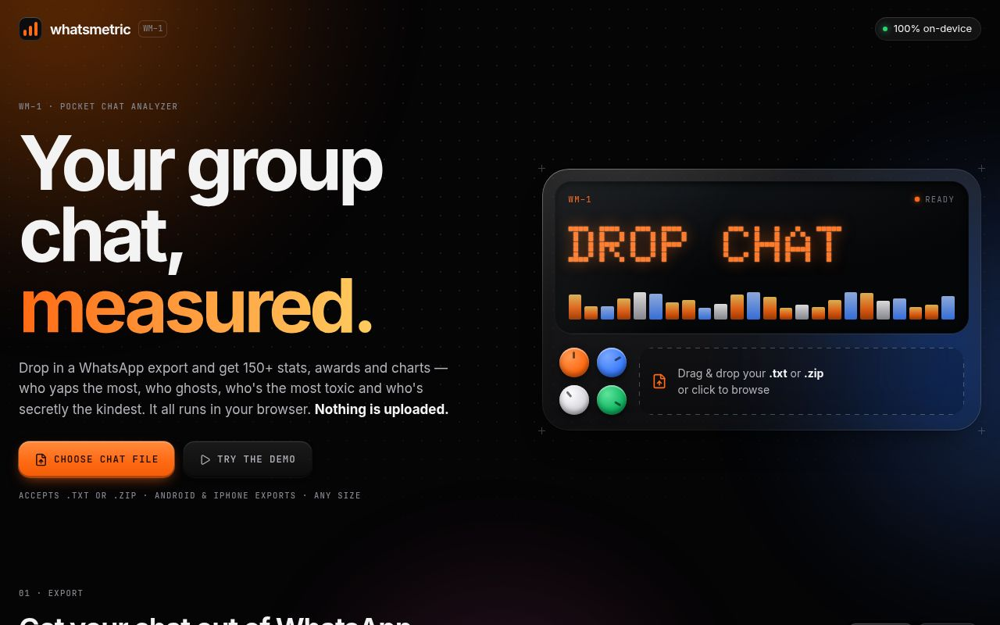
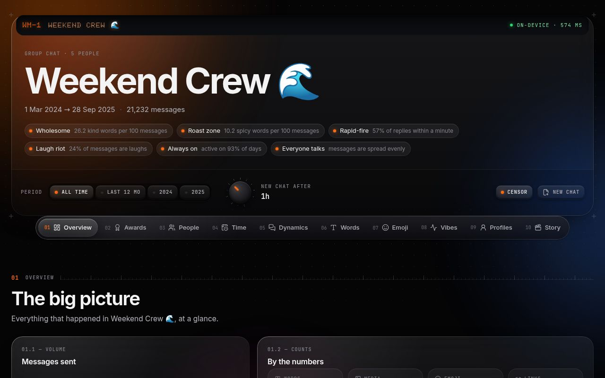
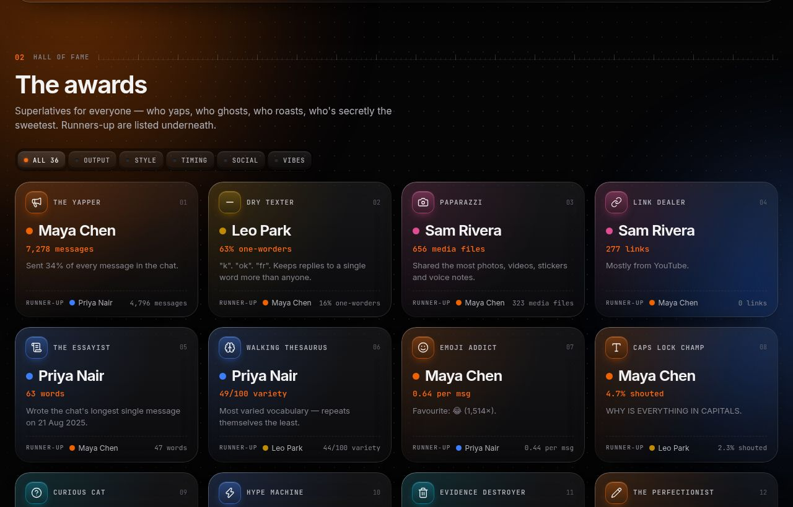
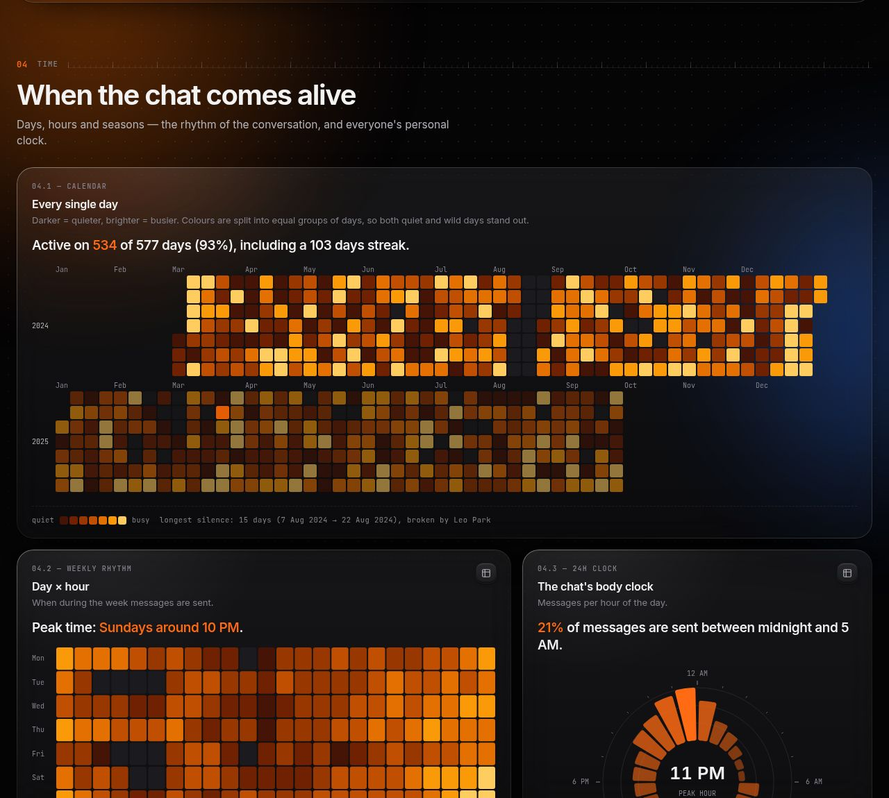
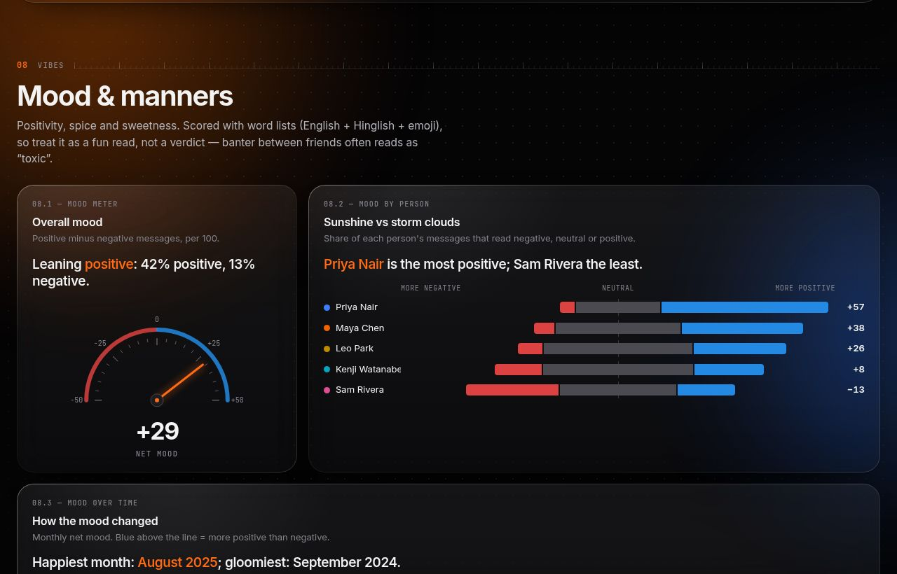
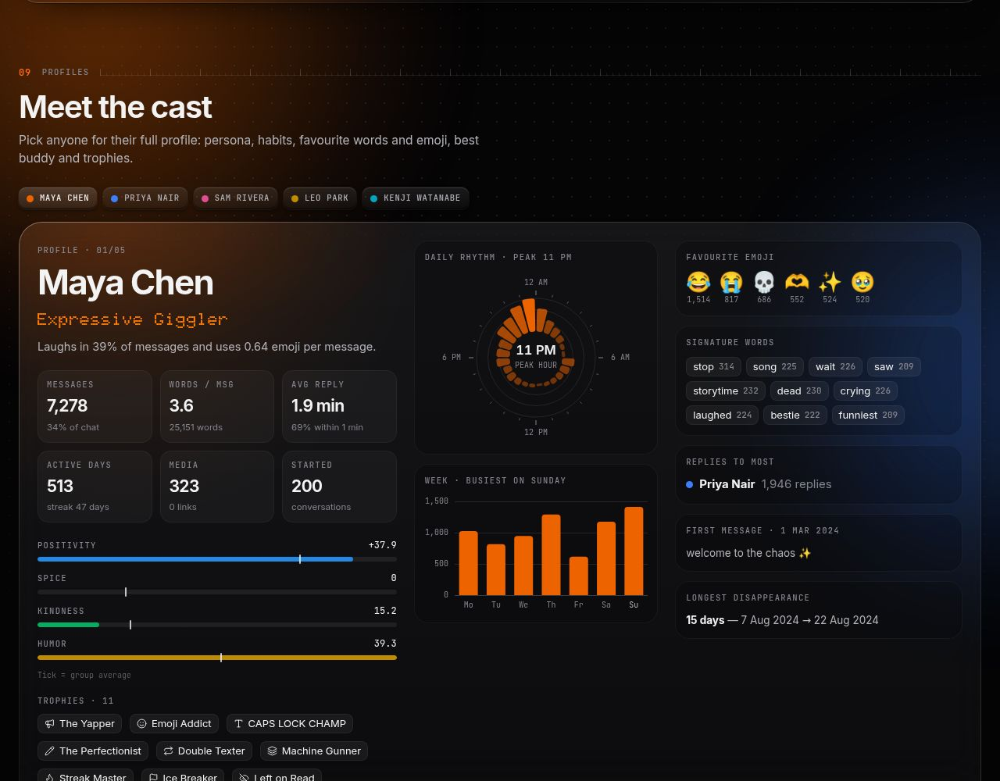

# WhatsMetric

**Your group chat, measured.** Drop in a WhatsApp chat export and get 150+ stats, 35 awards and 50+ charts: who yaps the most, who ghosts, who's the most toxic, who's secretly the kindest, when the chat comes alive, and everyone's verbal fingerprint.

Everything runs **in your browser**. The chat is parsed and analysed on your device (in a Web Worker) and is never uploaded anywhere.

<p align="center">
  
  
</p>
<p align="center">
  
  
</p>
<p align="center">
  
  
</p>

<sub>Screenshots use the built-in demo chat (five fictional friends), not real conversations.</sub>

---

## Features

The dashboard is one long report split into ten numbered modules. Every chart card leads with a plain-English answer ("Maya sends 34% of all messages — about 1 in 3"), and most cards can flip to a sortable table.

| Module | What you get |
| --- | --- |
| **01 Overview** | Total messages, words, media, emoji, links, active days, longest streak, longest silence, conversations, a daily/weekly timeline with the busiest day, and fun equivalents (novels of text, hours of typing/reading, time spent in conversation). |
| **02 Awards** | 35 superlatives with runners-up, including The Yapper, Novelist, Dry Texter, Paparazzi, Link Dealer, Essayist, Walking Thesaurus, Emoji Addict, CAPS LOCK Champ, Curious Cat, Hype Machine, Evidence Destroyer (deleted messages), Perfectionist (edits), Double Texter, Machine Gunner, Night Owl, Early Bird, Streak Master, The Ghost, Weekend Warrior, Speed Demon, Slowpoke, Ice Breaker, Left on Read, Class Clown, Easy Audience, Tagger, Main Character, Pollster, **Most Toxic**, **Kindest Soul**, Ray of Sunshine, Storm Cloud, Hopeless Romantic, Most Grateful, Sorry Not Sorry, and Drama Royalty. |
| **03 People** | Share-of-voice waffle chart, "who owns what" (messages, words, media, emoji, links, questions, laughs, tags, swears, kind words, deletions), monthly volume as stacked area / streamgraph / 100% share / rank race, message length, active days, and a 17-column sortable leaderboard. |
| **04 Time** | Calendar heatmap of every day, weekday × hour punch card, 24-hour radial clock, each person's "chronotype" ridgeline, busiest weekday, seasons (month of year / year by year), and time records (busiest day, busiest hour ever, busiest and quietest month, peak hour, night and morning share). |
| **05 Dynamics** | Conversation stats, who starts conversations, who gets left on read, reply speed per person, reply-time distribution, a chord diagram and friendship network of who replies to whom, a reply matrix, top duos, @mention matrix, message bursts, double texts, conversation sizes, kick-off times, reply speed by hour, and the longest conversation. |
| **06 Words** | Word cloud coloured by who says each word most, top words, **signature words** per person (statistically distinctive vocabulary), catchphrases (2- and 3-word phrases), topics (food, plans, study/work, money, gaming, movies/music, sports, love, tech, social media, sleep/health), a person × topic heat table, message-length histogram, the laugh-o-meter (haha / lol / lmao / 😂 / 💀 / 😭…), vocabulary variety, link domains, and the longest messages. |
| **07 Emoji** | Emoji totals, a keypad of favourites, emoji over time, per-person emoji fingerprints with "signature" emoji, and emoji rate. |
| **08 Vibes** | Mood dial, positive / neutral / negative split per person, mood over time, toxicity leaderboard, swear jar (censored by default), kindness leaderboard and breakdown (gratitude, apologies, affection, praise, support, politeness), an "angels & savages" kind-vs-toxic quadrant, emotion mix (joy, humor, love, surprise, worry, sadness, anger), emotion radars per person, toxicity and kindness over time, and the happiest, gloomiest, spiciest and sweetest days. |
| **09 Profiles** | A card for every person: a generated two-word persona (e.g. "Savage Ice Breaker", "Nocturnal Sweetheart"), key stats, mood/spice/kindness/humor meters against the group average, trophies, daily and weekly rhythm, favourite emoji, signature words, best buddy, first message, and longest disappearance. |
| **10 Story** | A timeline of firsts, message milestones (#1, #100, #1,000…), the busiest day, the marathon conversation, the longest silence and who broke it, group events (adds, removals, subject/description changes, pins), polls with results, and events. |

**Controls** (they scope everything below them):

- **Period**: all time, last 12 months, or any single year.
- **Silence knob**: how long a gap starts a new conversation (15 min – 12 h).
- **Censor**: masks swear words everywhere (on by default, so screenshots are shareable).

## Exporting a chat

- **Android**: open the chat → ⋮ → More → **Export chat** → *Without media* → save the `.txt` (or `.zip`).
- **iPhone**: open the chat → tap the name at the top → **Export Chat** → *Without Media* → save the `.zip` to Files (no need to unzip).

Then drop the file onto WhatsMetric, or click **Try the demo** to explore with a synthetic chat.

### Supported formats

- Android (`12/11/23, 3:41 PM - Name: …`) and iOS (`[12/11/23, 3:41:22 PM] Name: …`) exports
- 12- and 24-hour clocks (including the narrow no-break space newer exports use before AM/PM), with or without seconds
- Day-first, month-first and ISO dates with `/`, `.` or `-` separators. The order is inferred from the data, using chronology when ambiguous.
- `.txt` files and `.zip` archives (only the transcript is decompressed, so exports with media stay fast)
- Multi-line messages, media placeholders (`<Media omitted>`, `image omitted`, `IMG-… (file attached)`, `<attached: …>`), view-once/empty media, deleted and edited messages, polls, events, locations, contact cards, calls, @mentions and system notices (in several languages)

## Getting started

Requires Node.js 20.19+ (22 recommended).

```bash
npm install
npm run dev          # start the dev server
npm run build        # static site → dist/
npm run build:single # one self-contained HTML file → dist-single/index.html
npm test             # parser & analysis tests (Vitest)
npm run lint         # ESLint
npm run typecheck    # TypeScript
```

`dist/` can be hosted on any static host. The single-file build inlines scripts, styles, fonts and the analysis worker, so it can even be opened straight from disk.

**GitHub Pages:** in the repo settings set *Pages → Source* to *GitHub Actions*, then run the **Deploy to GitHub Pages** workflow from the Actions tab.

## How it works

```
File (.txt/.zip) → parser → per-message features → analysis → Report → React dashboard
                   └──────────── inside a Web Worker ─────────────┘
```

- **Parser** (`src/lib/parser`): detects the platform, infers the date order, joins continuation lines, and classifies every message (text, media, deleted, poll, event, location, contact, call) and system notice. Timestamps are stored as UTC-encoded wall-clock time, so daylight-saving time never shifts an hour.
- **Features** (`src/lib/analysis/features.ts`): tokens, emoji (skin tones merged), link domains, mentions, laughs, questions, caps, sentiment, toxicity, kindness, emotions and topics. They are computed once per chat and reused when the period changes, so switching years re-analyses in about 60 ms.
- **Analysis** (`src/lib/analysis/analyze.ts`): a single pass builds every aggregate in the report, and the awards, personas and "vibe tags" are derived from it.
- **UI** (`src/components`): React with hand-built SVG charts on top of d3 scale/shape/chord/force/cloud helpers.

### Methodology notes

- **Conversations** start after a configurable silence (default 1 h). The first speaker "starts" it; the last one "ends" it, and if their message got no reply, it was left on read.
- **Reply time** is the gap between someone's message and the next message from someone else (gaps over 12 h are ignored). Averages cap each reply at 1 hour, because exports only record minutes and a few overnight gaps would otherwise dominate.
- **Mood** uses the AFINN-165 lexicon tuned for chat slang, plus emoji valence and romanised-Hindi additions. Negation is handled in both English order ("not good") and Hindi order ("accha nahi").
- **Toxicity** weights swear words, slurs, insults and threats by severity (English, Hindi/Hinglish and some Kannada). Ambiguous abbreviations like "bc" (because, or a Hindi swear) only count when the chat is detected as Hinglish. **Kindness** counts thanks, apologies, pleases, affection, praise and support. Word lists can't read sarcasm, so friendly banter often scores as "toxic". Treat it as a fun read, not a verdict.
- **Signature words and emoji** use weighted log-odds with an informative Dirichlet prior (Monroe, Colaresi & Quinn 2008). **Vocabulary variety** is a moving-average type-token ratio, which is fair across chatty and quiet people.
- **Fairness thresholds**: rate-based awards require at least max(20, 1% of messages); awards need a meaningful winner (for example, nobody wins "Hype Machine" with 0.5% exclamation marks).
- People with under 1% of messages are grouped as "Others" in charts (they still appear in tables). Bots such as Meta AI are excluded from awards.

## Design

Dark only: **Apple Liquid Glass** surfaces (translucent, blurred, specular rims, a pointer-following sheen, floating capsule navigation with a sliding lens) combined with **Teenage Engineering**-style instrument details (numbered modules, monospace labels, hardware keys with LEDs, a rotary knob, a dot-matrix display, ruler ticks and registration marks).

Per-person colours follow an OP-1-inspired palette whose order was computationally validated for the dark surface: lightness band, chroma, colour-blind (protan/deutan) separation and contrast. Colours follow the person, not their rank, so filters never repaint anyone. Heatmaps use a single-hue "heat" ramp with a scale legend, and mood uses a blue ↔ red diverging scale with a neutral midpoint. Charts have hover and keyboard tooltips plus table views, and the layout honours `prefers-reduced-motion` and `prefers-reduced-transparency`.

## Project structure

```
src/
  lib/
    parser/      WhatsApp export parser, zip reader, tests
    analysis/    features, analysis, awards, personas, lexicons, tests
    engine/      Web Worker + main-thread fallback
    demo/        deterministic synthetic demo chat
    format.ts    number/date/duration formatting
  components/
    charts/      SVG & HTML chart components
    sections/    the ten dashboard modules
    ui/          glass primitives, keys, knob, tooltip, tables
  styles/        design tokens, glass, layout, charts, sections, landing
```

## Privacy

WhatsMetric makes no network requests with your data: there are no analytics, accounts or servers. Fonts are bundled. The only thing stored in the browser is the censor preference.
